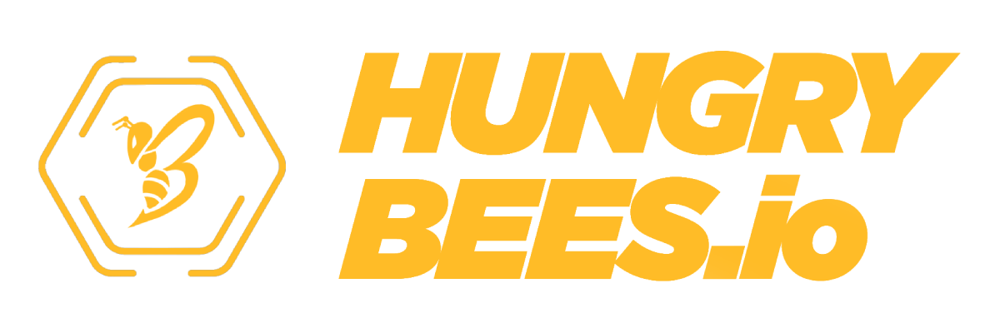

# 🐝 HUNGRYBEES


Si prefieres leerlo en español, visita [HungryBees Español](https://app.gitbook.com/s/Q0tj7rB2hYjxv2Be8NVo/)


HungryBees is an initiative which main purpose is to create a metaverse and raise awareness in society, especially among young people, about the impact of our actions on the planet. Our initiative promotes sustainability and socially responsible investment through gaming, new technologies, and the power of society.

By creating a virtual community, through a DApp (Distributed App), a "Play to Earn" model and a NFTs ecosystem, we want to have an impact and promote actions in the real world, offering the possibility to participate in a socially responsible initiative, which not only cares about the potential benefits, but also takes into account the environmental challenges and its social impact on the world.


.png>)           ****           Environmental, Social, Governance

.png>)       Play-to-Earn Metaverse

.png>)      Token Farming

.png>)      NFT Marketplace


.png>)


Avoid SCAMS

* HungreeBees is a trusted ESG metaverse
* Member of The Blockchain Arbitration Society, world's first virtual crypto jurisdiction ([https://theblockchainarbitration.com/](https://theblockchainarbitration.com))
* Legally advised by Ferrer-Bonsoms & Sanjurjo, Abogados, lawyers specialized in Blockchain, smartcontracts, ICO and digital contracts ([https://ferrer-bonsoms.com/](https://ferrer-bonsoms.com))
* ICO will be lanched on spanish jurisdiction. Forget tax heavens
* Always follow our official channels
  * .png>)  [Discord](https://discord.gg/wxmA4YVRgC)
  * &#x20;.png>)   [Instagram](https://instagram.com/hungrybees\_io)
  * &#x20;.png>)  [Twitter](https://twitter.com/Hungrybees\_io)

