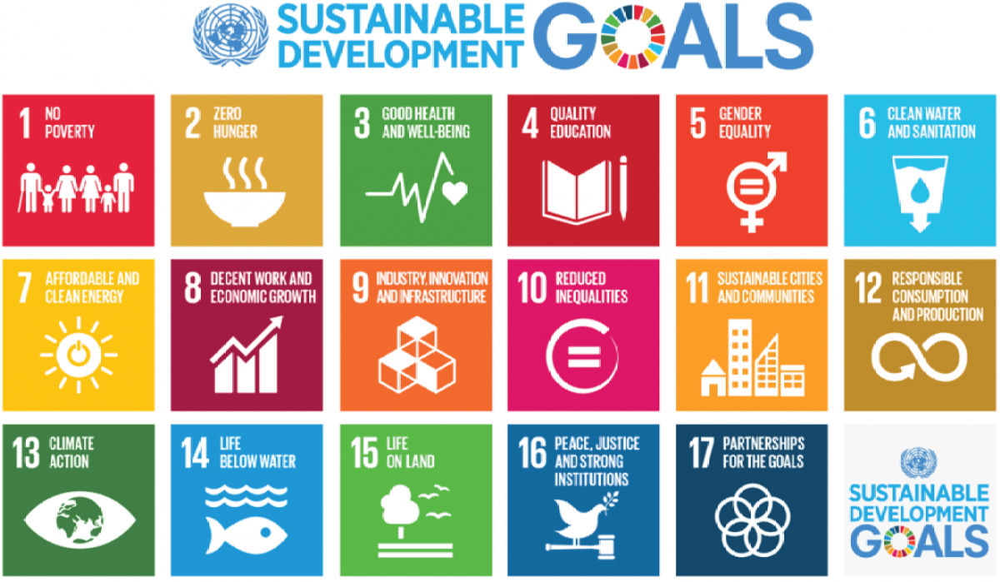

# 🍃 Sustainability - ESG

Humanity faces the year 2022 immersed in a great global crisis that not only puts at risk the guarantee of fundamental human rights but also its own survival, the sustainability of the planet and its ecosystems, and the welfare of many living beings. This crisis is marked by the widespread impoverishment of the population, globalization, inequalities, climate change, ecological overload, and the decline in democratic values and foundations in many countries.

These global challenges place us before the obligation to act and adopt a global perspective that promotes sustainable development, satisfying present needs without compromising the resources and capacities of future generations and guaranteeing a balance between economic growth, respect for the environment, and social well-being.

At Hungry Bees, we are aware of the situation and we are committed to change. That is why we have started on this initiative. Our mission is to raise awareness in society of the need for change in order to encourage a paradigm shift and promote sustainable development and investment.

And how are we going to do it? We are sure that the combination of the following levers will allow us to reach out to society, connect with people and promote real and tangible actions:

#### e-games

The unstoppable trend of online games and virtual worlds as a channel to attract the attention and interest of young people.

#### Blockchain technology and crypto assets

With double-digit growth, interest in digital assets or crypto assets has been driven by the transparency and security offered by blockchain technology.

#### ESG - Environmental, Social & Governance

The future of finance and investment is inexorably moving towards sustainability and social responsibility. Today´s society is looking for respectful and fairer investments.

Below, we describe several initiatives that this project try to promote:

| **Environmental Sustainability**                                                                                                                           | **Social Sustainability**                                                                                       | **Finantial Sustainability**                                                                                                                    |
| ---------------------------------------------------------------------------------------------------------------------------------------------------------- | --------------------------------------------------------------------------------------------------------------- | ----------------------------------------------------------------------------------------------------------------------------------------------- |
| 
Ø  Climate change

Ø Scarcity of resources Ø Efficient and renewable energy consumption 

Ø Sustainable agriculture

Ø CO2 emissions
 | 
Ø Access to financial services

Ø Circular economy

Ø Access to education and medical services
 | 
Ø Financial inclusion

Ø Democratize access to investment

Ø Equitable wealth

Ø Zero tolerance to any type of corruption
 |

