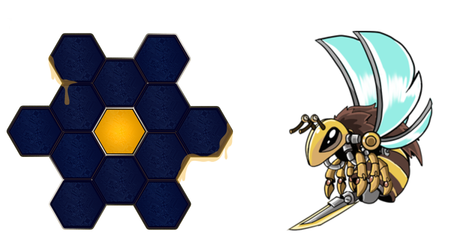

# 🛒 Marketplace

HungryBees will provide users, both buyers and sellers, a platform to buy and sell NFT assets (hives and bees) openly and straight in the community.

A maximum of 300,000 bees and 32,500 hives will be put on sale in the game. Therefore, once they are all sent, it will only be possible to purchase a bee or hive through the Marketplace. The scarcity of our NFT assets makes these items valuable not only for their ability to generate #HHON but also for the intrinsic value they have in the community.

For that reason, players are allowed to maintain ownership of all their acquired in-game items (NFTs) linked to their personal wallets. These NFTs, which will be deployed on Binance Smart Chain, will follow the BEP-721 and BEP-1155 standards, an extension of the ERC-721 and ERC-1155 standards. It will allow players, not only to sell their assets on our Marketplace but to be able to operate and trade with them in other NFT ecosystems, games, or decentralized markets (Rarible, for example).

To guarantee the correct maintenance of the Marketplace and the ecosystem, there will be a 5% commission for each NFT sale. The government team may adjust these commissions to balance the market and be able to encourage the creation and maintenance of the community.&#x20;


As an example, a promotional period of 1 week will be opened for the purchase of NFT assets of a unique nature, with special characteristics, and with a very limited offer.


Additionally, we will enable a system to check the status of your donation and check that everything has been done correctly.

#### NFT prices

The prices of the NFTs will remain stable in their initial sale until all of them will be purchased by the beekeepers, setting a price of 150 #HBEE for the bees and 1500 #HBEE for the hives. However, during pre-sales, the price will drop to 120 #HBEE and 1200 #HBEE respectively. Both the hives and the bees (larvae) will be acquired in their first sale in a random format. It won´t be possible to select the type and rarity of NFT that a beekeeper wants to acquire.

After concluding the initial sale of the NFTs, these can only be exchanged between users of the community through our Marketplace.

