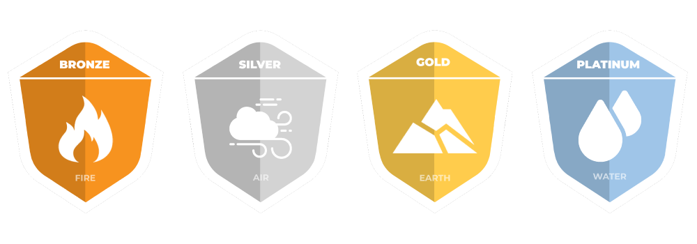

# 🥇 Collaborative ESG Reward Platform – Real life rewards

On the other hand, we introduced an alternative, innovative, and complementary way to monetize real-world actions, sustainable actions that have a real impact on the sustainability of our planet, and today´s society and economy. We are the first community that rewards and links the behavior of users in the real world, within the virtual metaverse of the game.

#### &#x20;How are we going to achieve this?

To encourage responsible behavior, sustainable investment, and social responsibility, we will reward different real-life actions, through a collaborative ESG reward platform. We show some examples of actions that will be rewarded in the community. It is just an illustrative list, not an exhaustive list:

* Contribute to recycling by separating waste (plastic, glass, paper, and cardboard) in your own home.
* Organize or participate in the waste collection on public roads or in environmental environments to be protected (beaches, rivers, forests, etc).
* Use of public transport for daily commuting.
* Use of car-sharing or electric vehicles for daily commuting.
* Use of non-polluting means of transport such as bicycles.
* Planting a tree.
* Use of local waste facilities of the city to deposit different polluting objects such as household appliances, light bulbs, pillars, or toners for recycling.
* Promote the circular economy by buying or using local products.
* Reuse of second-hand products.
* Reuse of food products to provide a second use, such as using used oil to make soap.
* Purchase of products with the organic, sustainable, or recycled product designation.
* Use of low consumption elements, such as light bulbs or household appliances.
* Moderate the use of heating and/or air conditioning.
* Installation of solar panels or alternative energy sources.
* Use 100% renewable energy in your home or business.
* Actions to reduce the carbon footprint.
* Waste reduction, like packaging reuse.
* Collaboration with associations for the defense of animal rights.
* Volunteering in different initiatives.
* Living without plastic.

In order to claim the associated reward, the user just must share on our social networks (Hungrybees\_io, Twitter & Instagram) a proof (image) of the realization of these sustainable actions, helping us to viralize the community and inciting other members of society to follow our example.&#x20;

The main goal of this initiative is to contribute to the awareness of society through socially, economically, and environmentally responsible actions.

The reward that community users will receive for each sustainable action will vary depending on the level or category of the user (explained in the next section) and the moment in time. As an example, the initial reward will vary between 20 #HHONS and 75 #HHONS for each sustainable action. Players will only be able to claim one sustainable action reward per week.


To measure and reward those members of the community who bring the most value to the initiative and who lead responsible behavior in the long term, we have defined a categorization/ranking/badges system that will allow access to advantages, private purchases, or access to premium services.&#x20;


Below, we show a table where we describe the advantages or benefits by category, as well as the requirements to access and promote from one category to another.

### Benefits/Rewards

|                                                          | No Badge | Bronze | Silver     | Gold                                  | Platinum                            |
| -------------------------------------------------------- | -------- | ------ | ---------- | ------------------------------------- | ----------------------------------- |
| Farming Improvements                                     | 0        | 0      | 0          | 
+0,5% 

 daily collection
 | 
+1%

recolección diaria
 |
| Priority access to the game                              | NO       | NO     | YES (BETA) | YES                                   | SI                                  |
| In game booster                                          | 0        | 1 item | 3 items    | 6 items                               | 10 items                            |
| Straight rewards in tokens for each action (#HHONS)      | 1.000    | 20     | 35         | 50                                    | 75                                  |
| Access to the VIP channel                                | NO       | NO     | NO         | YES                                   | YES                                 |
| Access to ecosystem´s promotions, services, and products | NO       | YES    | YES        | YES (premium)                         | SI (gratuito)                       |

### Requirements

|                                                            | No Badge | Bronze | Silver | Gold  | Platinum |
| ---------------------------------------------------------- | -------- | ------ | ------ | ----- | -------- |
| Minimum of #HBEE in user wallet                            | 50       | 250    | 1.000  | 5.000 | 10.000   |
| Minimum of NTFs in user wallet                             | 1        | 2      | 3      | 5     | 10       |
| Number of sustainable actions to upgrade to the next level | 0        | 5      | 10     | 25    | 35       |
| Minimum of NFT from ESG NFT Gallery in user wallet         | 0        | 0      | 1      | 3     | 5        |

