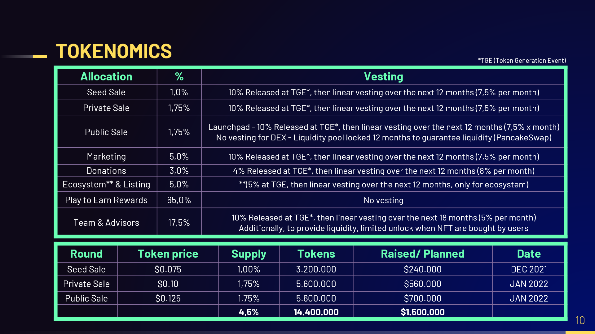

# 🚨 Seed, Private & Public Sale

| **Round**    | **Token Prize** | **Supply** | **Tokens**     | **Raised/ Planned** |
| ------------ | --------------- | ---------- | -------------- | ------------------- |
| Seed Sale    | $0.075          | 1,00%      | 3.200.000      | $240.000            |
| Private Sale | $0.10           | 1,75%      | 5.600.000      | $560.000            |
| Public Sale  | $0.125          | 1,75%      | 5.600.000      | $700.000            |
| Total        |                 | **4,5%**   | **14.400.000** | **$1.500.000**      |

### Seed Sale

Initial private sale whose main goal is to scale, grow the initiative and have better market resources (design, development, marketing, distribution ...). Tokens (HBEE) will be offered with a value of $ 0.075 each. As initial contributors, they will have the highest risk, but they will also be rewarded with the lowest price of the token. Our plan is to close this stage in 2 weeks.

### Private Sale

The objective of the second sale is to accelerate the game´s launch and the creation of the community, ensure security and perform an audit of both the code and the governance model. This will also allow us to close the first agreements with NGOs or companies in the sustainability ecosystem, looking for starting to have a real impact on initiatives such as climate change, food waste, or the loss of biodiversity. Tokens (HBEE) will be offered in this phase with a value of $ 0.1 per token.

### Public Sale

Public sale with be divided in two subphases:

#### Launchpad

Through different Launchpads (pending confirmation), we will make our token #HBEE available to the general public with an initial unit value of $ 0.125.

#### DEX Listing (PancakeSwap)

Once this first public sale subphase finishes, our token will be listed on various decentralized exchanges (DEX). As a first step, a liquidity pool (LP) will be created in PancakeSwap. In order to create this liquidity pool, the team will provision BNB in PancakeSwap, blocking this amount for at least 12 months. It will allow the token to be given liquidity over time. All this process will make it possible for the tokens to be always available for their exchanging on the Exchange, so you will be free to decide what to do with your tokens.

